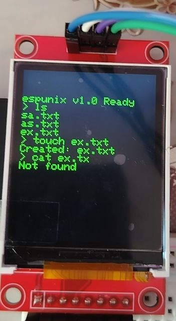

# espunix


> **"A minimal Unix-like OS for ESP32-S3"** system designed for ESP32-S3 microcontrollers, built on a robust **dual-bus (SPI2 and SPI3)** architecture.
> 
## Preview
Here is how `espunix` looks and operates in real-time. Whether you are checking system status or managing files, everything is handled via your terminal:

```text
Starting espunix OS...
espunix v1.0 Ready
/ $ fastfetch
--- espunix ---
Kernel: v1.0
Uptime: 42s
RAM Free: 184KB
SD: 64MB
CPU: S3 Dual-Core
/ $ echo "hello world" > sa.txt
/ $ cat sa.txt
hello world
```
## Features

- **Dual-Bus Architecture:** Independent and isolated SPI buses for the display and SD card to prevent hardware conflicts.
- **Unix-like Shell:** Full support for essential commands: `ls`, `cd`, `cat`, `touch`, `echo`.
- **Fastfetch:** Built-in system information tool to display uptime, RAM usage, and SD card status.
- **Non-blocking Console:** Optimized display driver to prevent system hangs during I/O operations.

## Hardware & Compatibility

### Supported Hardware
Currently, this repository is optimized for the following board:
- [ESP32-S3-N16R8](esp32-s3-n16r8.md)

### Porting to Other Boards
Hardware configurations vary significantly. If you are porting `espunix` to a different board (e.g., ESP32-EU, ESP32-C3), please create a new Markdown file and add it to the documentation. If you succeed, feel free to open a Pull Request!

> [!NOTE]
> If you port this project to another board, please submit your hardware documentation as a new `.md` file to help the community.

## Detailed Pinout (Default Setup: ESP32-S3)

For the current build, the dual-bus master configuration is as follows:

### 1. Display (SPI2)
| Function | GPIO Pin |
| :--- | :--- |
| TFT_CS | 4 |
| TFT_RST | 5 |
| TFT_DC | 6 |
| TFT_MOSI | 7 |
| TFT_SCLK | 15 |

### 2. SD Card (SPI3)
| Function | GPIO Pin |
| :--- | :--- |
| SD_CS | 16 |
| SD_MOSI | 13 |
| SD_SCLK | 12 |
| SD_MISO | 17 |

*(Please note: SD_MISO is vital for the SPI3 bus connection.)*

## Actual Hardware Setup
*(Insert your photos of the breadboard and wiring below)*


> [!IMPORTANT]
> The SD card must be formatted as **FAT32**. Ensure the physical "LOCK" switch on your SD card adapter is in the unlocked position.

## Contributing

`espunix` is open to community contributions. To contribute:

1. Fork the repository.
2. Create a new feature branch.
3. Commit your changes and open a Pull Request (PR).

---
*Created by [Your Name/Handle]*
